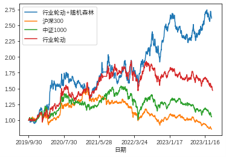

# 运行时，进入./行业内股票数据和./行业内股票数据/csv下载所需数据
# 各个模块的功能
## CS.py
用于计算“资金集中度”指标，这是本文最核心的部分，该指标的计算方法请参阅**Crowded Trades: Implications for Sector Rotation and Factor Timing (Kinlaw 2019)**，传送门**https://github.com/sprasadhpy/Crowded-trades-Sector-rotation**
## 相对估值.py
根据申万一级行业的市净率计算每个交易日各个行业相对估值的排名
## IC.py
用于计算信息比率，验证“资金集中度”因子的有效性
## 数据处理.py
使用talib库，根据每只股票的开盘价、收盘价、最高价、最低价、涨跌幅、成交量数据计算各种技术指标（约50个）
## 因子提取.py
在得到技术指标后，剔除冗余指标，选择影响性大的因子，最终选取了约30个
## ETF轮动收益率计算.py
把申万一级行业的指数视为投资标的，以行业指数的涨跌幅作为收益率，计算在行业轮动策略下，选择一整个行业进行投资的收益率是多少
## 回测框架
在上一步的基础上，利用随机森林算法，在行业内优中选优，计算行业内优质个股的投资回报

# 最终收益净值曲线如下

本项目附加了详细的注释，请参阅详细代码
